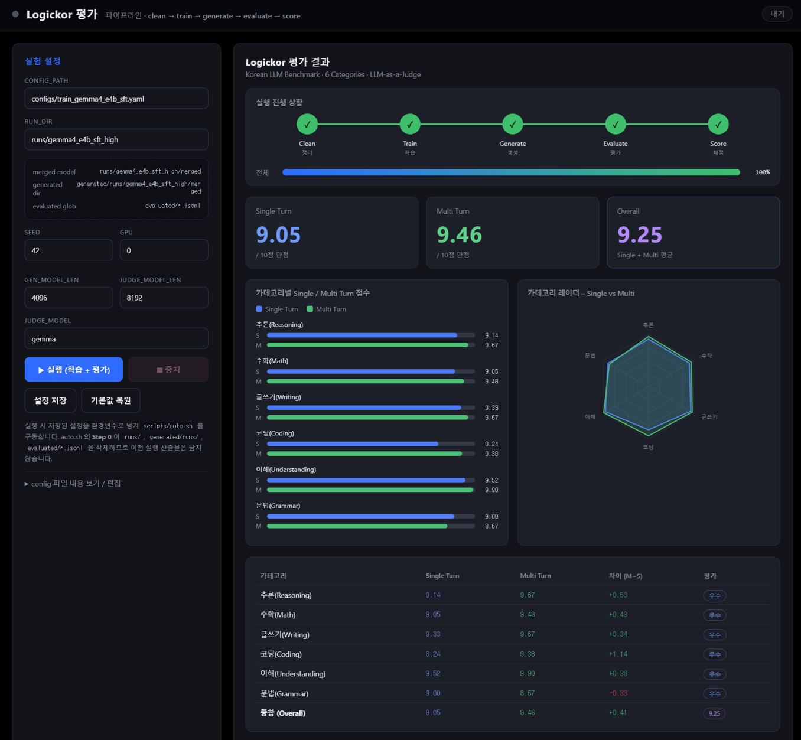

# Logickor 평가

한국어 LLM 벤치마크 **LogicKor** 기반의 학습 → 생성 → 평가 파이프라인과, 이를 브라우저에서
실행·모니터링할 수 있는 웹 UI 입니다.

파이프라인은 `clean → train → generate → evaluate → score` 5단계로 동작하며,
평가 결과는 6개 카테고리(추론 / 수학 / 글쓰기 / 코딩 / 이해 / 문법)의 Single·Multi Turn 점수로 산출됩니다.



## 1. 환경 준비

```bash
conda create -n etin python=3.11.15 -y
conda activate etin
python -m pip install --no-deps -r requirements.txt
```

> `--no-deps` 는 검증된 버전 스냅샷을 그대로 설치하기 위한 옵션이므로 반드시 붙여주세요.

## 2. HF 토큰 설정

실행 전에 본인의 Hugging Face 토큰을 환경변수로 등록해야 합니다. (모델 다운로드에 사용)

```bash
export HF_TOKEN=hf_xxxxxxxxxxxxxxxxxxxxxxxx
```

## 3. 실행

```bash
bash web/run.sh
```

- 기본 주소: <http://0.0.0.0:8000> (환경변수 `HOST`, `PORT` 로 변경 가능)
- 원격 서버에서 실행한 경우 포트 포워딩 후 접속하세요.

  ```bash
  ssh -L 8000:localhost:8000 <계정>@<서버>
  ```

## 4. 웹에서 평가하기

웹을 실행하면 기본적으로 **`gemma4_e4b_sft_high`** 모델을 평가하도록 설정되어 있습니다.

| 항목 | 기본값 | 설명 |
|---|---|---|
| `CONFIG_PATH` | `configs/train_gemma4_e4b_sft.yaml` | 학습 설정 yaml |
| `RUN_DIR` | `runs/gemma4_e4b_sft_high` | 학습 산출물 경로 |
| `SEED` | `42` | 랜덤 시드 |
| `GPU` | `0` | 사용할 GPU 번호 |
| `GEN_MODEL_LEN` | `4096` | 생성 모델 최대 길이 |
| `JUDGE_MODEL` | `gemma` | 판단(심판) 모델 |
| `JUDGE_MODEL_LEN` | `8192` | 판단 모델 최대 길이 |
| `TRAIN_FRACTION` | `0.01` | 학습에 사용할 데이터 비율 |

- **`TRAIN_FRACTION` 을 조절**해 학습에 사용할 데이터 양을 바꿀 수 있습니다.
  (예: `0.01` = 1%, `0.1` = 10%, `1.0` = 전체). 값이 작을수록 빠르게 파이프라인 전체를
  점검할 수 있고, 이때의 점수는 참고용입니다.
  샘플링은 `question_id` 단위라 turn1/turn2 쌍이 깨지지 않습니다.
- 설정을 마친 뒤 **▶ 실행 (학습 + 평가)** 버튼을 클릭하면 평가가 시작됩니다.
  진행 상황과 실시간 로그가 화면에 표시되고, 완료되면 카테고리별 점수·레이더 차트·종합 점수를 확인할 수 있습니다.
- 실행 중에는 **■ 중지** 버튼으로 언제든 파이프라인을 종료할 수 있습니다.

> 참고: 평가를 수행하는 **판단(judge) 모델은 기본적으로 현재 모델(로컬 오픈 모델)을 사용**합니다.
> 추후 필요에 따라 **유료 API 모델로 변경 가능**하도록 구성되어 있습니다.

## 5. 폴더 구조

| 경로 | 설명 |
|---|---|
| `configs/` | 모델별 학습 설정 yaml |
| `data/` | 학습 데이터 (LogicKor SFT) |
| `scripts/` | 파이프라인 스크립트 (`auto.sh`, `train.sh`, `generate.sh`, `evaluate.sh`, `score.sh`) |
| `web/` | 웹 UI (`app.py`, `index.html`, `run.sh`) |
| `generated/` | 모델 생성 결과 |
| `evaluated/` | 평가 결과 (`*.jsonl`) |
| `train/` | 학습 코드 |
| `logickor_eval/` | LogicKor 평가 모듈 |

자세한 웹 UI 설명은 [`web/README.md`](web/README.md) 를 참고하세요.
