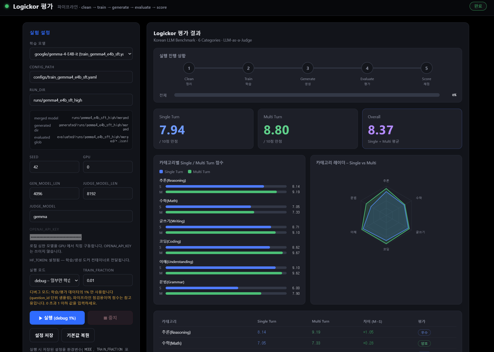

# Logickor 평가

한국어 LLM 벤치마크 **LogicKor** 기반의 학습 → 생성 → 평가 파이프라인과, 이를 브라우저에서
실행·모니터링할 수 있는 웹 UI 입니다.

파이프라인은 `clean → train → generate → evaluate → score` 5단계로 동작하며,
평가 결과는 6개 카테고리(추론 / 수학 / 글쓰기 / 코딩 / 이해 / 문법)의 Single·Multi Turn 점수로 산출됩니다.



## 1. 환경 준비 (도커 이미지 빌드)

모든 단계는 도커 컨테이너에서 실행됩니다. 호스트에는 **도커**와 **NVIDIA 드라이버**만 있으면 되고,
파이썬 패키지를 따로 설치할 필요가 없습니다.

| 이미지 | Dockerfile | requirements | 쓰이는 곳 |
|---|---|---|---|
| `logickor-train` | `Dockerfile-train` | `requirements/etri-training.txt` (Python 3.12) | **학습**(Step 1) |
| `logickor-infer` | `Dockerfile-infer` | `requirements/etri-infer.txt` (Python 3.11) | **생성·채점·집계**(Step 2~4)와 **웹 UI** |

```bash
cd Logickor_api2

docker build -f Dockerfile-infer -t logickor-infer:latest .
docker build -f Dockerfile-train -t logickor-train:latest .
```

- 두 이미지 모두 requirements 스냅샷을 `--no-deps` 로 설치합니다(검증된 버전 고정).
- CUDA 런타임은 `nvidia-*-cu12` 휠에 들어 있으므로 별도의 CUDA 이미지가 필요 없습니다.
- 빌드 컨텍스트는 `requirements/` 만 사용합니다(`.dockerignore`). 프로젝트 소스는 이미지에 넣지 않고
  **실행할 때 마운트**하므로, 코드를 고쳐도 다시 빌드할 필요가 없습니다.
- 빌드는 처음 한 번만 하면 됩니다(수 GB 다운로드, 수십 분 소요).

빌드 확인:

```bash
docker images | grep logickor
```

> 도커를 `sudo` 없이 쓰려면 한 번만: `sudo usermod -aG docker $USER` 후 다시 로그인하세요.

## 2. HF 토큰 설정

실행 전에 본인의 Hugging Face 토큰을 환경변수로 등록해야 합니다. (모델 다운로드에 사용)

```bash
export HF_TOKEN=hf_xxxxxxxxxxxxxxxxxxxxxxxx
```

이 토큰은 `web/run.sh` → `scripts/auto.sh` → 각 도커 컨테이너까지 자동으로 전달됩니다
(웹 UI 에 입력칸은 없고, 상단에 `HF_TOKEN: 설정됨` 으로 표시됩니다).
호스트의 `~/.cache/huggingface` 가 컨테이너에 그대로 마운트되므로 이미 받아둔 모델은 다시 받지 않습니다.
받아둔 모델만 쓸 거라면 `export HF_TOKEN_OPTIONAL=1` 로 토큰 검사를 건너뛸 수 있습니다.

## 3. 실행

```bash
export HF_TOKEN=hf_xxxxxxxxxxxxxxxxxxxxxxxx
bash web/run.sh
```

`web/run.sh` 는 웹 UI 를 `logickor-infer` 컨테이너로 띄우고, 웹에서 **▶ 실행**을 누르면
`scripts/auto.sh` 가 단계별로 컨테이너를 만들어 돌립니다.

```
web/run.sh ──> [logickor-infer] 웹 UI
                     └─ scripts/auto.sh
                          ├─ Step 1 학습     -> [logickor-train]  컨테이너
                          ├─ Step 2 생성     -> [logickor-infer]  컨테이너
                          ├─ Step 3 채점     -> [logickor-infer]  컨테이너
                          └─ Step 4 집계     -> [logickor-infer]  컨테이너
```

- 기본 주소: <http://0.0.0.0:8000> (환경변수 `HOST`, `PORT` 로 변경 가능)
- 원격 서버에서 실행한 경우 포트 포워딩 후 접속하세요.

  ```bash
  ssh -L 8000:localhost:8000 <계정>@<서버>
  ```

### 개별 단계만 실행하기

각 스크립트도 같은 이미지를 사용합니다(학습만 train 이미지, 나머지는 infer 이미지).

```bash
bash scripts/train.sh    configs/train_gemma4_e4b_sft.yaml runs/gemma4_e4b_sft_high
bash scripts/generate.sh runs/gemma4_e4b_sft_high/merged
JUDGE_MODEL=gemma bash scripts/evaluate.sh generated/runs/gemma4_e4b_sft_high/merged
bash scripts/score.sh    'evaluated/runs/gemma4_e4b_sft_high/merged/*.jsonl'

# 파이프라인 전체를 CLI 로:
bash scripts/auto.sh
```

### 도커 관련 환경변수

| 변수 | 기본값 | 설명 |
|---|---|---|
| `TRAIN_IMAGE` | `logickor-train:latest` | 학습 이미지 이름 |
| `INFER_IMAGE` | `logickor-infer:latest` | 생성/채점/집계/웹 이미지 이름 |
| `HF_CACHE_DIR` | `~/.cache/huggingface` | 컨테이너에 마운트할 모델 캐시 |
| `DOCKER_HOME` | `<프로젝트>/.docker-home` | 컨테이너의 HOME (torch/triton 캐시 유지용) |
| `DOCKER_GPUS` | `all` | `docker run --gpus` 값 (GPU 선택은 기존대로 `GPU` 변수로) |
| `DOCKER_SHM_SIZE` | `16g` | vLLM 용 `/dev/shm` 크기 |
| `DOCKER_EXTRA_ARGS` | (없음) | `docker run` 에 덧붙일 옵션 |
| `WEB_IN_DOCKER` | `1` | `0` 이면 웹 UI 만 호스트 파이썬으로 실행(auto.sh 는 그대로 도커 사용) |
| `DOCKER_DRY_RUN` | `0` | `1` 이면 실행 없이 만들어질 `docker run` 명령만 출력 |

- 컨테이너는 **호스트 사용자 uid** 로 실행되므로 `runs/`, `generated/`, `evaluated/` 산출물이
  root 소유로 남지 않습니다.
- GPU 번호는 호스트와 동일합니다. 컨테이너에 GPU 를 전부 붙이고(`--gpus all`)
  기존처럼 `GPU`(=`CUDA_VISIBLE_DEVICES`)로 고릅니다.

## 4. 웹에서 평가하기

웹을 실행하면 기본적으로 **`gemma4_e4b_sft_high`** 모델을 평가하도록 설정되어 있습니다.

| 항목 | 기본값 | 설명 |
|---|---|---|
| `CONFIG_PATH` | `configs/train_gemma4_e4b_sft.yaml` | 학습 설정 yaml |
| `RUN_DIR` | `runs/gemma4_e4b_sft_high` | 학습 산출물 경로 |
| `SEED` | `42` | 랜덤 시드 |
| `GPU` | `0` | 사용할 GPU 번호 |
| `GEN_MODEL_LEN` | `4096` | 생성 모델 최대 길이 |
| `JUDGE_MODEL` | `gemma` | 판단(심판) 모델 (`gemma` / `llama` / `gpt-4.1`) |
| `OPENAI_API_KEY` | (없음) | `gpt-4.1` 등 OpenAI 심판 모델을 쓸 때만 필요 |
| `JUDGE_MODEL_LEN` | `8192` | 판단 모델 최대 길이 (로컬 모델에만 적용) |
| `JUDGE_TPM` | `30000` | OpenAI 심판 모델의 분당 토큰 한도 (이 예산에 맞춰 요청 속도 조절) |
| `TRAIN_FRACTION` | `0.01` | 학습에 사용할 데이터 비율 |

- **`TRAIN_FRACTION` 을 조절**해 학습에 사용할 데이터 양을 바꿀 수 있습니다.
  (예: `0.01` = 1%, `0.1` = 10%, `1.0` = 전체). 값이 작을수록 빠르게 파이프라인 전체를
  점검할 수 있고, 이때의 점수는 참고용입니다.
  샘플링은 `question_id` 단위라 turn1/turn2 쌍이 깨지지 않습니다.
- 설정을 마친 뒤 **▶ 실행 (학습 + 평가)** 버튼을 클릭하면 평가가 시작됩니다.
  진행 상황과 실시간 로그가 화면에 표시되고, 완료되면 카테고리별 점수·레이더 차트·종합 점수를 확인할 수 있습니다.
- 실행 중에는 **■ 중지** 버튼으로 언제든 파이프라인을 종료할 수 있습니다.

> 참고: 평가를 수행하는 **판단(judge) 모델은 기본적으로 로컬 오픈 모델(`gemma`, `llama`)을 사용**합니다.
> `JUDGE_MODEL` 을 **`gpt-4.1`** 로 바꾸면 유료 OpenAI API 로 채점합니다. 이때는 GPU 를 쓰지 않는 대신
> **`OPENAI_API_KEY` 가 필요**하며, 웹 UI 의 `JUDGE_MODEL` 아래 입력칸이나 환경변수로 지정합니다.

### 채점 실패 항목 다시 채점하기

채점에 실패한 항목은 0 점이 아니라 '측정 불가'(`judge_score: null`)로 기록되고 평균에서 제외됩니다.
`score.py` 가 `! 채점 실패로 평균에서 제외된 항목: N개` 를 출력하면 그 점수는 부분 표본 기준이므로,
**실패한 항목만** 다시 채점한 뒤 점수를 다시 내야 합니다(파일을 지우면 이미 성공한 채점까지 다시 합니다).

```bash
JUDGE_MODEL=gpt-4.1 bash scripts/evaluate.sh generated/runs/<모델>/merged --rejudge-failed
bash scripts/score.sh 'evaluated/runs/<모델>/merged/*.jsonl'
```

OpenAI 판단 모델은 계정의 **분당 토큰 한도(TPM)** 에 걸리면 채점이 실패합니다. `JUDGE_TPM`
(기본 30000, `evaluator.py --tpm`)을 계정 한도에 맞추면 그 예산에 맞춰 요청 속도를 조절하므로
429 로 항목을 잃지 않습니다. 한도가 더 높은 계정이면 값을 올려 채점 시간을 줄일 수 있습니다.

## 5. 폴더 구조

| 경로 | 설명 |
|---|---|
| `Dockerfile-infer` | 생성·채점·집계·웹 UI 이미지 (`requirements/etri-infer.txt`) |
| `Dockerfile-train` | 학습 이미지 (`requirements/etri-training.txt`) |
| `requirements/` | 두 환경의 pip 버전 스냅샷 |
| `configs/` | 모델별 학습 설정 yaml |
| `data/` | 학습 데이터 (LogicKor SFT) |
| `scripts/` | 파이프라인 스크립트 (`auto.sh`, `train.sh`, `generate.sh`, `evaluate.sh`, `score.sh`, 공통 도커 설정 `docker_env.sh`) |
| `web/` | 웹 UI (`app.py`, `index.html`, `run.sh`) |
| `generated/` | 모델 생성 결과 |
| `evaluated/` | 평가 결과 (`*.jsonl`) |
| `train/` | 학습 코드 |
| `logickor_eval/` | LogicKor 평가 모듈 |

자세한 웹 UI 설명은 [`web/README.md`](web/README.md) 를 참고하세요.
