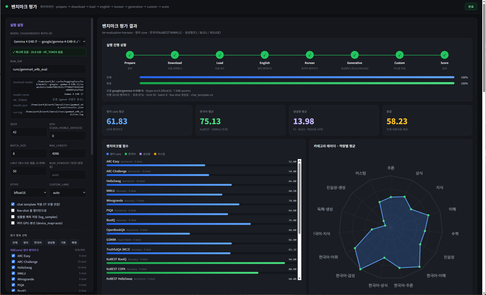

# LM-Eval 벤치마크 평가 대시보드



`lm-evaluation-harness` 로 HuggingFace 모델을 **영어 core / 한국어 / 생성형 지표 /
커스텀 파일** 벤치마크로 평가하고, 진행 상황과 결과를 웹 대시보드에서 보는 도구입니다.

### 지원 모델

좌측 **MODEL** 드롭다운에서 고르거나, `직접 입력` 으로 아무 repo id/경로나 넣을 수 있습니다.

| 선택 | repo id | 비고 |
|---|---|---|
| Qwen3 8B | `Qwen/Qwen3-8B` | `Qwen3ForCausalLM`, bfloat16 |
| Gemma 4 E4B IT | `google/gemma-4-E4B-it` | `Gemma4ForConditionalGeneration` (멀티모달 래퍼 → 텍스트 디코더만 사용), **gated** |

모델 지정은 세 가지 형태를 모두 받습니다.

- repo id — `Qwen/Qwen3-8B` (권장, **캐시에 없으면 실행 시 자동 다운로드**)
- HF 캐시 디렉터리 — `~/.cache/huggingface/hub/models--Qwen--Qwen3-8B`
- 로컬 스냅샷 경로 — `config.json` 이 있는 디렉터리

캐시 디렉터리를 넣어도 내부적으로 repo id 로 환원해, 파일이 일부만 받아져 있으면
빠진 파일만 이어받습니다.

### HF_TOKEN (gated 모델)

`google/gemma-4-E4B-it` 처럼 gated 인 모델을 **처음 내려받을 때** 는 토큰이 필요합니다.
HF 사이트에서 라이선스에 동의한 뒤, **서버를 띄우는 셸에서** 내보내세요.

```bash
export HF_TOKEN=hf_xxxxxxxxxxxxxxxx
python app.py --port 7860
```

토큰 설정 여부는 대시보드 좌측 정보 상자(`HF_TOKEN` 행)와 서버 시작 로그에서 확인할 수
있습니다. 이미 캐시에 받아 둔 모델은 토큰 없이도 그대로 평가됩니다.

---

## 1. 설치

### conda (권장)

```bash
conda env create -f environment.yml
conda activate lmeval
```

### pip

```bash
python -m venv .venv && source .venv/bin/activate
# CUDA 12 드라이버면 먼저: pip install torch --index-url https://download.pytorch.org/whl/cu128
pip install -r requirements.txt
```

> gemma-4 는 `transformers>=5.5.0.dev0` 에서 지원되므로 두 파일 모두
> `transformers` 를 git main 에서 설치합니다. 이미 다른 버전이 설치돼 있으면
> `pip install -U "git+https://github.com/huggingface/transformers.git@main"` 로 갱신하세요.

## 2. 실행

```bash
export HF_TOKEN=hf_xxx           # gated 모델을 새로 받을 때만 필요
python app.py --port 7860        # → http://localhost:7860
```

`/api/status`·`/api/gpus` 같은 폴링 요청의 액세스 로그는 기본으로 숨깁니다
(오류 응답과 그 밖의 요청은 그대로 출력). 전부 보려면 `--access-log` 를 붙이세요.

```bash
python app.py --port 7860 --access-log
```

원격 서버라면 로컬에서 포트 포워딩:

```bash
ssh -L 7860:localhost:7860 <user>@<server>
```

CLI 로만 돌릴 수도 있습니다.

```bash
# 스모크 테스트 (태스크당 20 샘플)
python run_eval.py --model Qwen/Qwen3-8B \
  --tasks arc_easy,kobest_copa,squadv2 --limit 20 \
  --out runs/smoke --apply-chat-template

# 캐시에 없으면 자동 다운로드. 받지 않고 캐시만 쓰려면 --no-download
python run_eval.py --model Qwen/Qwen3-8B --tasks arc_easy --limit 20 \
  --out runs/smoke --no-download

# 정식 측정 (limit 미지정 = 전체 데이터셋)
python run_eval.py --model google/gemma-4-E4B-it \
  --tasks arc_easy,arc_challenge,hellaswag,mmlu,winogrande,piqa,boolq,openbookqa,gsm8k,truthfulqa_mc2,kobest_boolq,kobest_copa,kobest_hellaswag,kobest_sentineg,kobest_wic,kmmlu,squadv2,truthfulqa_gen \
  --out runs/full --batch-size auto --log-samples
```

## 3. 화면 구성

| 영역 | 내용 |
|---|---|
| 좌측 **실험 설정** | MODEL(드롭다운) / MODEL_PATH / RUN_DIR / SEED / GPU / BATCH_SIZE / MAX_LENGTH / LIMIT / NUM_FEWSHOT / DTYPE, chat template·멀티턴·샘플저장·멀티GPU 토글, 평가 항목 체크박스, 커스텀 파일 설정, 실행·중지·저장·복원, config YAML 편집기, GPU 상태 |
| **실행 진행 상황** | 파이프라인 단계(Prepare → Download → Load → English → Korean → Generative → Custom → Score) + 전체 진행률 + 현재 태스크 진행률(tqdm 후킹) |
| 요약 카드 | 영어 core 평균 / 한국어 평균 / 생성형 평균 / 종합 |
| 벤치마크별 점수 | 그룹 색상별 막대 (영어=파랑, 한국어=초록, 생성형=보라, 커스텀=주황) |
| 카테고리 레이더 | 추론·상식·지식·수학·이해·진실성·한국어·생성 등 역량별 평균 |
| 생성형 지표 표 | F1 / EM / BLEU / ROUGE-1 / ROUGE-2 / ROUGE-L |
| 전체 지표 상세 | 태스크별 모든 지표·stderr·샘플 수·소요 시간·상태 |
| 실행 로그 | `RUN_DIR/run.log` 실시간 tail |

## 4. 평가 항목

**1) 대표(core) 영어** — ARC-Easy/Challenge, HellaSwag, MMLU, Winogrande, PIQA,
BoolQ, OpenBookQA, GSM8K, TruthfulQA(MC2)

**2) 한국어** — KoBEST(boolq / copa / hellaswag / sentineg / wic), KMMLU,
KMMLU-Direct, HAE-RAE

**3) 생성형 지표** — SQuADv2(F1/EM), TruthfulQA-gen(BLEU/ROUGE), DROP(F1/EM)

**4) 커스텀 파일** — 사용자 JSON/JSONL/CSV(입력-정답 쌍)로 생성 후
F1 / EM / BLEU / ROUGE 계산 (`custom_metrics.py`)

항목을 추가·수정하려면 `eval_tasks.py` 의 리스트에 한 줄 추가하면 됩니다.
(`task` 는 lm-eval task 이름, `primary` 는 대표 지표 후보 순서)

```python
dict(key="klue_nli", task="klue_nli", label="KLUE NLI",
     primary=["acc"], num_fewshot=5, category="한국어-추론"),
```

## 5. 커스텀 파일 형식

컬럼 이름은 자동 탐지합니다.
입력: `input|prompt|question|instruction|query|src|text`,
정답: `answer|answers|output|reference|references|target|label|gold`,
선택: `context|passage|document`.
정답이 리스트면 복수 정답으로 보고 최댓값(F1/EM/ROUGE)을 취합니다.

```jsonl
{"question": "대한민국의 수도는?", "answer": ["서울", "서울특별시"]}
{"context": "...", "question": "...", "answer": "..."}
```

CLI 단독 실행:

```bash
python custom_eval.py --model google/gemma-4-E4B-it \
  --file custom_data/sample_ko.jsonl --out runs/custom \
  --max-new-tokens 256 --lang ko
```

**한국어 토큰화**: 한글 비중이 높은 텍스트는 공백(어절) 단위 F1/ROUGE 가
과소평가되므로 **문자 단위** 토큰화를 사용합니다(`custom_lang=ko` 로 강제 가능,
`en` 은 공백 단위, `auto` 는 자동 판별). BLEU 도 한국어면 sacrebleu `char`
토크나이저를 씁니다. 지표는 모두 0~100 스케일로 통일합니다.

## 6. 산출물

```
runs/<RUN_DIR>/
├── status.json              # 실시간 진행 상황(웹 UI 가 폴링)
├── run.log                  # 전체 실행 로그
├── results.json             # 최종 결과(요약 + 벤치마크별 지표)
├── custom_results.json      # 커스텀 평가 지표 + 샘플별 점수
├── custom_samples.jsonl     # 커스텀 평가 입력/예측/정답
└── tasks/<key>.json         # lm-eval 원본 결과(태스크별)
    tasks/<key>_samples.jsonl  # log_samples=true 일 때 샘플별 예측
```

## 7. 지표 스케일 규칙

벤치마크마다 하네스가 보고하는 스케일이 달라(같은 `f1` 이 SQuADv2 는 0~100,
KoBEST 는 0~1) 아래 순서로 판정해 화면에는 **전부 0~100 으로 통일**합니다
(`eval_tasks.py` / `run_eval.py`).

1. 태스크 메타의 `pct` 집합에 있으면 이미 0~100 → 변환 없음
   (squadv2 `f1/exact`, truthfulqa_gen `bleu_*`·`rouge*_max/diff`)
2. `UNBOUNDED`(perplexity 류)는 백분율이 아니므로 그대로 표시
3. 값이 1.0 을 넘으면 이미 백분율로 보고된 것으로 간주(accuracy·f1 은 분수
   스케일에서 1.0 을 넘을 수 없음)
4. 나머지 0~1 값은 100 을 곱함 (stderr 도 동일 규칙으로 변환)

## 8. 성능 / 실무 팁

- **처음에는 `LIMIT=50`** 으로 전체 파이프라인이 도는지 확인한 뒤 전체 평가로 넘어가세요.
  전체 측정은 MMLU(14k) + KMMLU(35k) 때문에 A100 1장에서 수 시간~하루가 걸립니다.
- `BATCH_SIZE=auto` 는 lm-eval 이 메모리에 맞춰 자동 조정합니다. OOM 이 나면 정수로 낮추세요.
- **chat template**: instruction-tuned 모델(`-it`)은 켜는 것이 실사용에 가깝습니다.
  단, 공개 리더보드 수치와 비교할 때는 관례상 끄고(loglikelihood 방식) 측정합니다.
- GPU 2장을 쓰려면 `GPU=0,1` + `여러 GPU 분산` 체크(= `device_map=auto`).
- 첫 실행은 HuggingFace 에서 데이터셋을 내려받습니다. 오프라인 환경이면
  `HF_DATASETS_OFFLINE=1` 전에 미리 캐시를 채워두세요.
- 실행 중 `중지` 는 프로세스 그룹에 SIGTERM 을 보내며, 그 시점까지의 결과는
  `status.json` 에 남습니다.

## 9. 파일 구성

| 파일 | 역할 |
|---|---|
| `app.py` | Flask 웹 서버 (설정 저장, 실행/중지, 상태·로그 API) |
| `run_eval.py` | 평가 러너 (lm-eval 호출, `status.json` 기록, 결과 정규화) |
| `eval_tasks.py` | 벤치마크 레지스트리(그룹·대표지표·few-shot·카테고리) |
| `custom_metrics.py` | F1 / EM / BLEU / ROUGE 구현 (한국어 문자 단위 지원) |
| `custom_eval.py` | 커스텀 JSON/CSV 생성 평가 |
| `model_loader.py` | HF 캐시 경로 해석 + 멀티모달 래퍼 안전 로딩 |
| `templates/`, `static/` | 대시보드 UI (외부 CDN 없이 동작) |
| `configs/default.yaml` | 실험 설정 (웹 UI 저장 대상) |
| `custom_data/` | 커스텀 평가 샘플 데이터 |
| `runs/smoke_example/` | 스모크 실행 산출물 예시(limit=8, 7개 벤치마크) |

## 10. 검증 상태

이 환경(A100 80GB ×2, conda `lmeval`)에서 실제로 확인한 항목:

- `Gemma4ForConditionalGeneration` 로드(bf16, 7.94B) 및 lm-eval `HFLM` 연동
- 21개 등록 태스크 이름이 lm-eval 0.4.12 에 모두 존재
- 객관식(ARC/KoBEST) · 생성+EM(GSM8K) · F1(SQuADv2) · BLEU/ROUGE(TruthfulQA-gen)
  · 커스텀 파일 평가까지 `limit=8` 스모크 통과 (`runs/smoke_example/`)
- 웹 UI 실행/폴링/중지(SIGTERM) 전 과정 및 모든 API 엔드포인트
- gemma 계열은 `add_bos_token=True` 로 자동 설정(하네스 권고)
- 설치된 버전: python 3.11 · torch 2.13.0+cu130 · transformers 5.16.0.dev0 · lm_eval 0.4.12

점수 자체는 `limit` 을 준 스모크 값이므로 모델 성능 지표로 해석하면 안 됩니다.
